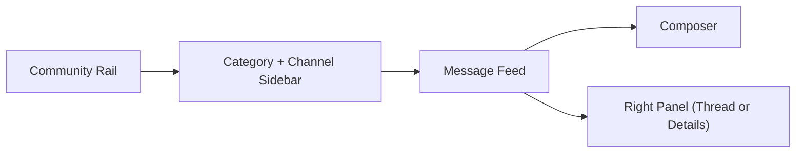

# Community Messenger Design Document

Status: Draft v1  
Last updated: 2026-03-20  
Audience: product/design/engineering handoff

## 1. Summary

This document defines a community messenger inspired by:

- Discord for community-first navigation and social energy
- Zulip for conversation organization, unread handling, and long-term knowledge retention

The recommended product is a web-first, multi-community messaging platform with:

- Discord-like left rail, category list, and live chat feel
- Optional persistent threads and forum-style channels instead of mandatory topics everywhere
- Strong moderation, roles, search, unread state, and attachment support

The goal is to give the next implementation agent a concrete MVP target with clear product boundaries, domain objects, API contracts, and rollout phases.

## 2. Product Goals

### Goals

1. Build a community-first messenger that feels familiar to Discord/Slack users.
2. Keep conversations easy to follow as communities grow.
3. Support both fast chat and slower, knowledge-building discussion.
4. Ship a realistic MVP without voice/video, federation, or enterprise complexity.
5. Make moderation and permission controls first-class from the start.

### Non-Goals

1. Voice/video rooms in MVP
2. End-to-end encryption
3. Federation with other servers
4. Full bot marketplace or plugin ecosystem
5. Native mobile apps in MVP
6. Email-style mandatory topic structure on every message

## 3. Product Principles

### 3.1 Familiar shell

The app should feel immediately understandable to Discord/Slack users:

- left rail for communities
- channel/category sidebar
- central message pane
- optional right panel for thread details, members, or pinned items

### 3.2 Organized by default, not rigid by default

Zulip's strongest idea is organized conversation. Discord's strongest idea is low-friction social chat.  
This product combines them by:

- keeping normal text channels for fast-flowing chat
- supporting persistent threads on any message
- supporting forum-style channels for structured discussion
- adding an inbox/unread model without forcing every message into a topic

### 3.3 Moderation-first

Communities fail when moderation is an afterthought. MVP includes:

- roles and permissions
- report flow
- mute/kick/ban
- slow mode
- audit logging

### 3.4 Searchable institutional memory

Important conversations should stay findable. Threads, search, pins, and structured channels should make old discussions reusable instead of disposable.

## 4. Target Users

### 4.1 Member

- joins communities
- reads channels
- posts messages, reactions, and attachments
- participates in threads

### 4.2 Moderator

- manages reports
- deletes or hides content
- applies member discipline
- manages channel-level hygiene

### 4.3 Admin

- configures community structure
- manages roles and permissions
- manages invites and channel visibility

### 4.4 Owner

- ultimate authority for community settings and ownership transfer

## 5. Core Product Decisions

### 5.1 Top-level information architecture

The platform supports multiple communities. A single deployment may host one or many communities.

Hierarchy:

`Platform -> Community -> Category -> Channel -> Message -> Thread Reply`

### 5.2 Channel types

MVP includes three channel types:

1. `chat`
   - default real-time chat channel
   - supports inline replies, reactions, attachments, and optional threads

2. `announcement`
   - posting restricted to admins/mods
   - members can read and react

3. `forum`
   - every top-level post must have a title
   - each post becomes a persistent discussion thread
   - ideal for support, proposals, Q&A, guides, and long-form discussion

This gives the product a strong Discord-like feel while covering Zulip's organizational strengths.

### 5.3 Thread model

- Any message in a `chat` channel can spawn a thread.
- Threads are persistent by default.
- Thread replies do not pollute the main channel feed after creation.
- Users can follow/unfollow threads.
- `forum` channels are effectively thread-first channels.

### 5.4 Direct messages

Out of scope for MVP.  
Rationale: community messaging is the primary goal, and DMs add privacy, abuse, and moderation complexity.

### 5.5 Presence and typing

MVP includes:

- online/offline presence
- typing indicator per channel/thread

Do not include rich status, custom activities, or voice presence in MVP.

## 6. MVP User Experience

### 6.1 Layout

### 6.2 Desktop navigation

- Left rail: community icons
- Sidebar: categories, channels, unread badges
- Main pane:
  - channel header
  - message list or forum post list
  - composer
- Right panel:
  - thread view
  - member list
  - pinned messages

### 6.3 Mobile-responsive behavior

- Left rail collapses into a drawer
- Channel sidebar becomes a slide-over panel
- Thread panel becomes full-screen stack navigation
- Composer stays sticky to bottom

### 6.4 Unread model

Unread state should combine Discord familiarity with Zulip clarity:

- unread badge on community
- unread badge on channel
- mention badge distinct from general unread
- thread follow state for thread-specific unread
- inbox page aggregating:
  - mentions
  - replies in followed threads
  - moderator actions relevant to the user

### 6.5 Message interactions

MVP message actions:

- react
- reply in thread
- copy link
- edit own message
- delete own message
- pin if permitted
- report

## 7. Functional Requirements

### 7.1 Authentication

MVP auth:

- email magic link
- optional OAuth providers later

Requirements:

- unique verified email per account
- session revocation support
- device/session list in settings later, not MVP-critical

### 7.2 Community management

- create community
- upload icon/banner
- configure name, slug, description
- public or invite-only visibility
- create invite links

### 7.3 Roles and permissions

Default roles:

- owner
- admin
- moderator
- member
- guest

Permissions should be additive and channel-aware.

Core permission set:

- view channel
- post message
- create thread
- upload attachment
- react
- manage messages
- pin messages
- manage channels
- manage roles
- moderate members
- manage invites

### 7.4 Categories and channels

- create/update/delete/reorder categories
- create/update/archive channels
- channel visibility by role
- slow mode per channel

### 7.5 Messaging

- rich text lite markdown
- emoji reactions
- attachments
- edit history not exposed in MVP UI
- deleted messages should soft-delete for auditability

### 7.6 Search

MVP search scope:

- message body
- author
- channel
- thread title for forum/thread entries

Filters:

- by channel
- by author
- has attachment
- date range

### 7.7 Moderation

- report message
- mute member
- kick member
- ban member
- delete/hide message
- lock thread
- audit log for admin/mod actions

### 7.8 Notifications

MVP notifications:

- in-app unread and mention badges
- optional email for mentions and invite acceptance later

Push notifications are out of scope for web MVP.

## 8. Recommended Technical Architecture

This section defines the reference implementation target for the next AI.

### 8.1 Stack

- Frontend: Next.js + React + TypeScript
- API server: Node.js + TypeScript
- Real-time transport: WebSocket
- Database: PostgreSQL
- Cache/pub-sub: Redis
- File storage: S3-compatible object storage
- Search: PostgreSQL full-text search for MVP

### 8.2 Why this stack

- TypeScript reduces ambiguity across frontend/backend contracts.
- PostgreSQL is enough for MVP relational needs plus basic search.
- Redis helps with WebSocket fan-out, presence, and rate limits.
- S3-compatible storage avoids local filesystem coupling.

### 8.3 Service boundaries

Single deployable app is acceptable for MVP, but code should be split logically into:

- auth module
- community module
- channel module
- message module
- thread module
- moderation module
- notification module
- realtime module

### 8.4 API style

- REST for CRUD and list endpoints
- WebSocket for live events

Avoid GraphQL in MVP to keep the contract simpler for implementation.

## 9. Data Model

All IDs should use ULID or UUIDv7 for sort-friendly generation.

### 9.1 Core entities

#### `users`

- id
- email
- display_name
- username
- avatar_url
- bio
- created_at
- updated_at
- status

#### `communities`

- id
- slug
- name
- description
- icon_url
- banner_url
- visibility (`public`, `invite_only`, `private`)
- owner_user_id
- created_at
- updated_at

#### `community_memberships`

- id
- community_id
- user_id
- joined_at
- membership_status (`active`, `muted`, `banned`, `left`)
- last_read_inbox_at

#### `roles`

- id
- community_id
- name
- color
- priority
- is_system_role

#### `membership_roles`

- membership_id
- role_id

#### `categories`

- id
- community_id
- name
- position

#### `channels`

- id
- community_id
- category_id
- name
- description
- type (`chat`, `announcement`, `forum`)
- visibility (`public`, `role_restricted`)
- slow_mode_seconds
- position
- is_archived
- created_at
- updated_at

#### `channel_role_permissions`

- id
- channel_id
- role_id
- permission_key
- effect (`allow`, `deny`)

#### `threads`

- id
- channel_id
- root_message_id
- title
- created_by_user_id
- is_locked
- is_pinned
- reply_count
- last_activity_at

For `forum` channels, every top-level post creates a thread with `title`.

#### `messages`

- id
- community_id
- channel_id
- thread_id nullable
- parent_message_id nullable
- author_user_id
- body_markdown
- body_plaintext
- message_type (`user`, `system`)
- is_edited
- is_deleted
- created_at
- updated_at

#### `attachments`

- id
- message_id
- storage_key
- file_name
- mime_type
- file_size
- width nullable
- height nullable

#### `reactions`

- id
- message_id
- user_id
- emoji
- created_at

#### `thread_follows`

- thread_id
- user_id
- last_read_message_id nullable

#### `channel_reads`

- channel_id
- user_id
- last_read_message_id nullable
- unread_count_cache optional
- mention_count_cache optional

#### `reports`

- id
- community_id
- message_id nullable
- reported_user_id nullable
- reporter_user_id
- reason_code
- reason_text
- status (`open`, `resolved`, `dismissed`)
- created_at
- resolved_by_user_id nullable

#### `moderation_actions`

- id
- community_id
- actor_user_id
- target_user_id nullable
- target_message_id nullable
- action_type
- reason
- created_at

#### `invites`

- id
- community_id
- code
- created_by_user_id
- expires_at nullable
- max_uses nullable
- use_count

### 9.2 Notes on model choices

- `messages.thread_id` is nullable so the same table works for channel feed and thread replies.
- `threads.root_message_id` makes thread creation cheap and message linking stable.
- `body_plaintext` supports basic search indexing.
- Channel and thread read tables should support efficient unread computation.

## 10. API Contract

Representative endpoints only. The next AI can expand these without changing the model.

### 10.1 Auth

- `POST /api/auth/magic-link/request`
- `POST /api/auth/magic-link/verify`
- `POST /api/auth/logout`
- `GET /api/me`

### 10.2 Communities

- `GET /api/communities`
- `POST /api/communities`
- `GET /api/communities/:communityId`
- `PATCH /api/communities/:communityId`
- `POST /api/communities/:communityId/invites`
- `POST /api/invites/:code/join`

### 10.3 Categories and channels

- `POST /api/communities/:communityId/categories`
- `PATCH /api/categories/:categoryId`
- `POST /api/communities/:communityId/channels`
- `PATCH /api/channels/:channelId`
- `POST /api/channels/:channelId/archive`

### 10.4 Messages

- `GET /api/channels/:channelId/messages?cursor=...`
- `POST /api/channels/:channelId/messages`
- `PATCH /api/messages/:messageId`
- `DELETE /api/messages/:messageId`
- `POST /api/messages/:messageId/reactions`
- `DELETE /api/messages/:messageId/reactions/:emoji`

### 10.5 Threads

- `POST /api/messages/:messageId/thread`
- `GET /api/threads/:threadId/messages?cursor=...`
- `POST /api/threads/:threadId/messages`
- `POST /api/threads/:threadId/follow`
- `DELETE /api/threads/:threadId/follow`
- `POST /api/threads/:threadId/lock`

### 10.6 Search

- `GET /api/search/messages?q=...&communityId=...`

### 10.7 Moderation

- `POST /api/reports`
- `GET /api/communities/:communityId/reports`
- `POST /api/members/:membershipId/mute`
- `POST /api/members/:membershipId/kick`
- `POST /api/members/:membershipId/ban`
- `GET /api/communities/:communityId/audit-log`

## 11. WebSocket Event Contract

Event names should be explicit and versionable.

### 11.1 Channel events

- `channel.created`
- `channel.updated`
- `channel.archived`

### 11.2 Message events

- `message.created`
- `message.updated`
- `message.deleted`
- `message.reaction_added`
- `message.reaction_removed`

### 11.3 Thread events

- `thread.created`
- `thread.updated`
- `thread.locked`

### 11.4 Presence events

- `presence.updated`
- `typing.started`
- `typing.stopped`

### 11.5 Moderation events

- `member.muted`
- `member.banned`
- `report.created`

### 11.6 Event payload guidance

Payloads should include:

- entity id
- community id
- channel id when applicable
- actor id when applicable
- server timestamp

Use snapshot-style payloads in MVP rather than patch diffs. This is simpler and easier to reason about.

## 12. Security, Privacy, and Abuse Controls

### 12.1 Authentication and sessions

- signed, expiring sessions
- CSRF protection for cookie-based auth
- rate-limit auth requests
- magic link tokens single-use only

### 12.2 Authorization

- enforce permissions on every channel and moderation action
- never trust client-side role checks
- channel visibility checks must apply to reads, search, and WebSocket subscription

### 12.3 Attachment safety

- store uploads outside the app server filesystem
- sanitize file names
- validate MIME type and extension
- render inline preview only for safe types
- force download for risky binary types

### 12.4 Abuse prevention

- rate limits on message send, thread creation, reactions, and invites
- slow mode support
- basic spam heuristics later
- audit log for moderator actions

### 12.5 Privacy

- no public email exposure
- role-restricted channels excluded from search results for unauthorized users
- moderator-only reports invisible to regular members

## 13. Performance and Reliability Targets

### MVP performance targets

- cold channel load: under 1.5s for recent 50 messages on broadband
- send-to-render latency: under 300ms median in same region
- forum post list load: under 1.5s for first page

### MVP reliability targets

- durable message writes through database transaction before broadcast
- idempotent message create support using client-generated request id
- reconnect and resync flow for WebSocket disconnects

## 14. UX Details Worth Preserving

These are not optional polish items. They materially affect usability.

### 14.1 Composer behavior

- markdown-lite input
- drag/drop upload
- paste image support
- mention autocomplete
- channel/thread context shown clearly above input

### 14.2 Empty states

- channel with no messages explains purpose and posting guidance
- forum channel explains expected post format
- locked thread explains why posting is disabled

### 14.3 Member identity

- stable display name + username
- role color accent in member list and message meta
- compact profile card on hover/click

### 14.4 Discoverability

- community onboarding should surface:
  - start here
  - announcements
  - introductions
  - support/help

## 15. MVP Delivery Scope

### Included in MVP

- authentication with magic link
- multi-community support
- categories and channels
- chat, announcement, and forum channels
- messages, reactions, attachments
- persistent threads
- unread badges and inbox
- search
- roles/permissions
- moderation basics
- audit log

### Deferred to V2

- direct messages
- voice/video
- bot platform
- push notifications
- advanced search ranking
- mobile native apps
- federation
- end-to-end encryption

## 16. Suggested Implementation Order

The next AI should implement in this order:

1. Auth, users, communities, memberships
2. Categories, channels, roles, permissions
3. Basic channel messaging over REST
4. WebSocket real-time delivery
5. Threads and forum channels
6. Reactions, attachments, unread state
7. Moderation and audit log
8. Search and inbox

This sequence keeps the system usable early while avoiding a giant integration step at the end.

## 17. Open Questions

These do not block MVP, but should be resolved before implementation starts if product preferences are strong.

1. Should the first release support only one community per deployment, even if the schema supports many?
2. Should invite-only communities allow public read-only landing pages?
3. Should forum channels allow anonymous or pseudonymous posting in some communities?
4. Should email notifications for mentions be in MVP or V1.1?

## 18. Final Recommendation

Build a community messenger with:

- Discord-style shell and social affordances
- Zulip-inspired organization through forum channels, persistent threads, inbox, and strong unread handling
- a concrete MVP centered on text communities, not voice or enterprise complexity

If engineering needs a single sentence target:

> Build a Discord-like community app with forum channels and Zulip-like inbox/search discipline, using a TypeScript web stack and a PostgreSQL-centered architecture.
